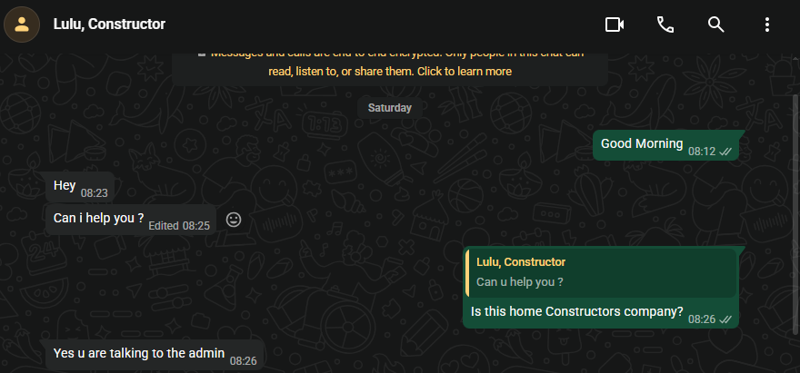
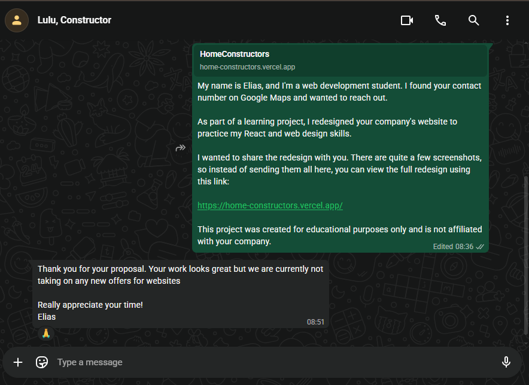

# Outreach Proof

## Overview

After completing the redesign of the Home Constructors website, I contacted the company to share my work. I introduced myself, explained that this was a learning project, and shared screenshots of the redesigned website.

The purpose of the outreach was to showcase the improvements I made and give the company an opportunity to view the redesigned website.

---

## Original Website

The original Home Constructors website can be viewed here:

**Original Website:**  
PASTE_OLD_WEBSITE_LINK_HERE

---

## My Redesigned Website

The redesigned website is available here:

**Live Website:**  
https://home-constructors.vercel.app/

---

## Project Presentation

I also created a Loom video explaining the redesign, the technologies used, and the development process.

**Loom Presentation:**  
https://www.loom.com/share/32937619268e413e8a2020f84a5e3a50

---

## Proof of Outreach

The image below shows proof that I contacted Home Constructors and shared my redesign.

---

## Technologies Used

- React
- JavaScript
- Tailwind CSS
- React Router
- Vite

---

